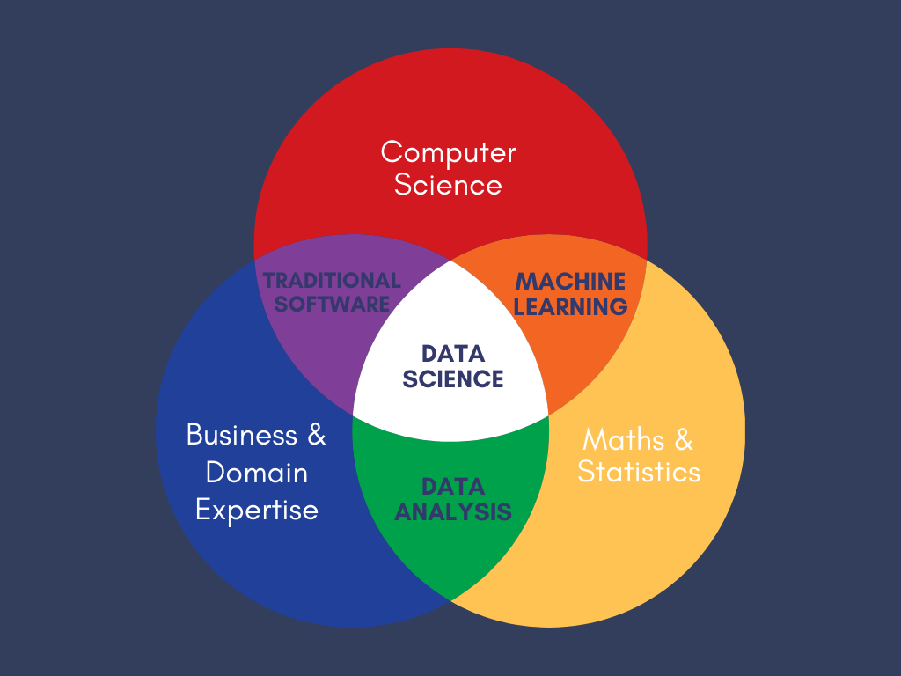

# My Degree - Full-Stack Data Science

## Introduction

  As a data scientist with *"only"* a bachelor’s in Physics and Mathematics, I have the feeling that I have reached the frontiers of my current knowledge. To prevent stagnation in my long-term growth, I have designed this curriculum.

This aims to address several areas, the first one being a foundational recap of the background theory of statistics/probably, machine learning and neural networks. Whilst I have had a moderate chunk of experience in these areas within my degree and job, there are holes and rusty parts of my knowledge. Before starting more advanced courses, I think would make sense to recap the theory that most of these courses build upon.

The second centre of attention will focus much more on technical skills. It is fine having strong theory but implementing the theory is a whole other beast. I think that technical skill is an important area to master. Most of the time, this is what a business will care the most about. Whilst I believe my technical skill to be at a decent level, there are definite deficiencies in my level experience. To be clear, however, I am not a beginner in my abilities. The areas that will take the spotlight are:
- General data engineering
- MLOps
- General cloud platform knowhow
- Tensorflow/PyTorch
- Software engineering principles

Software engineering principles may appear to be a strange addition to this list - (anecdotally) many data scientists do not focus on this area all too much. As I do not have a computer science background, when I compare my knowledge of coding principles to people that do, I often feel like my knowledge is lacklustre. As well as this, personally, I spend much of my time coding. Therefore, I believe this is a good justification to include this as an area worthy of study to a greater depth.

The third and final area pivots towards leadership and management skills. This is arguably not data science! This is an important area for me for two reasons. Firstly, I would eventually like to manage a team. Developing management skills now will aid this goal. As well as that, I strive to better people around me. Having leadership skills assists with this.

## Course Structure

### Foundational Recap

### [CS229: Machine Learning (Stanford)](https://cs229.stanford.edu/syllabus-summer2020.html)

> CS229 provides a broad introduction to statistical machine learning (at an intermediate / advanced level) and covers supervised learning (generative/discriminative learning, parametric/non-parametric learning, neural networks, support vector machines); unsupervised learning (clustering, dimensionality reduction, kernel methods); learning theory (bias/variance tradeoffs, practical ); and reinforcement learning among other topics. The structure of the summer offering enables coverage of additional topics, places stronger emphasis on the mathematical and visual intuitions, and goes deeper into the details of various topics.

### Random Forests and Gradient Boosting
*TODO: More in depth reading will be needed to be added here. Papers on random forests will should be added.*

- [Decision Trees](https://www.youtube.com/watch?v=q90UDEgYqeI)
- [Random Forests](https://www.youtube.com/playlist?list=PLblh5JKOoLUIE96dI3U7oxHaCAbZgfhHk)
- [Gradient Boost](https://www.youtube.com/playlist?list=PLblh5JKOoLUJjeXUvUE0maghNuY2_5fY6)
- [XGBoost](https://www.youtube.com/watch?v=GrJP9FLV3FE)

### [CS230: Deep Learning (Stanford)](https://cs230.stanford.edu/)

> Deep Learning is one of the most highly sought after skills in AI. In this course, you will learn the foundations of Deep Learning, understand how to build neural networks, and learn how to lead successful machine learning projects. You will learn about Convolutional networks, RNNs, LSTM, Adam, Dropout, BatchNorm, Xavier/He initialization, and more.

Important links:
- [Hidden files that include exam papers](https://cs230.stanford.edu/files/)
